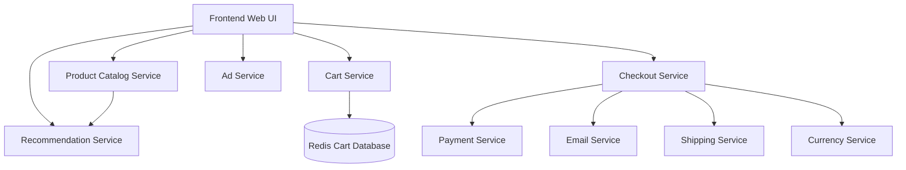

# Microservices K8s Helm Tutorial

[](https://kubernetes.io/)
[](https://helm.sh/)
[](LICENSE)
[]()

A comprehensive hands-on tutorial for deploying microservices applications, demonstrating the evolution from conventional Kubernetes YAML manifests to modern Helm Charts implementation using Google's Hipster Shop microservices demo.

## 🎯 Learning Objectives

By completing this tutorial, you will learn to:

- Deploy microservices using native Kubernetes YAML manifests
- Understand the challenges of managing multiple microservices configurations
- Create reusable Helm Charts for microservices applications
- Implement template-based deployment strategies
- Use Helmfile for managing multiple Helm releases
- Apply DevOps best practices for containerized applications
- Troubleshoot common deployment issues across different platforms

## 🏗️ Architecture Overview

This tutorial uses Google's **Hipster Shop** - a cloud-native microservices demo application consisting of 11 microservices:

### Application Architecture



**Microservices Components:**
- **Frontend**: Web UI and user interface
- **Product Catalog Service**: Product information and inventory
- **Cart Service**: Shopping cart functionality
- **Recommendation Service**: Product recommendations
- **Ad Service**: Advertisement display
- **Checkout Service**: Order processing
- **Payment Service**: Payment processing
- **Email Service**: Notification emails
- **Shipping Service**: Shipping calculations
- **Currency Service**: Currency conversion
- **Redis Cart**: In-memory database for cart data

## 🚀 Quick Start

### Prerequisites

Ensure you have the following tools installed:

- **Kubernetes Cluster** (minikube, kind, or cloud provider)
- **kubectl** v1.20+
- **Helm** v3.x
- **Helmfile** (latest)
- **Docker** (for building/testing)

### Installation

```bash
# Clone the repository
git clone https://github.com/your-username/microservices-k8s-helm-tutorial.git
cd microservices-k8s-helm-tutorial

# Make scripts executable (Linux/macOS)
chmod +x install.sh uninstall.sh

# For Windows users, run PowerShell scripts
# .\install.ps1
```

### Deploy the Application

```bash
# Option 1: Use automation script
./install.sh

# Option 2: Manual deployment with Helmfile
kubectl create namespace microservices-demo
helmfile sync

# Option 3: Individual Helm deployments
helm install frontend ./charts/microservice -f ./values/frontend-values.yaml -n microservices-demo
```

### Access the Application

```bash
# Get the application URL
kubectl get services -n microservices-demo

# For minikube users
minikube service frontend -n microservices-demo

# For port forwarding
kubectl port-forward -n microservices-demo service/frontend 8080:80
```

Visit `http://localhost:8080` to see the Hipster Shop application.

## 📁 Project Structure

```
microservices-k8s-helm-tutorial/
│
├── charts/                          # Helm Charts directory
│   │
│   ├── microservice/               # Generic microservice chart
│   │   ├── Chart.yaml             # Chart metadata
│   │   ├── values.yaml            # Default values
│   │   └── templates/             # Kubernetes templates
│   │       ├── deployment.yaml    # Deployment template
│   │       ├── service.yaml       # Service template
│   │       └── _helpers.tpl       # Template helpers
│   │
│   └── redis/                     # Redis-specific chart
│       ├── Chart.yaml
│       ├── values.yaml
│       └── templates/
│
├── values/                        # Values files for each service
│   ├── frontend-values.yaml
│   ├── cartservice-values.yaml
│   ├── checkout-service-values.yaml
│   ├── currency-service-values.yaml
│   ├── email-service-values.yaml
│   ├── payment-service-values.yaml
│   ├── productcatalog-service-values.yaml
│   ├── recommendation-service-values.yaml
│   ├── redis-values.yaml
│   └── shipping-service-values.yaml
│
├── config.yaml                   # Native Kubernetes manifests
├── helmfile.yaml                 # Helmfile configuration
├── install.sh                    # Installation script (Linux/macOS)
├── install.ps1                   # Installation script (Windows)
├── uninstall.sh                  # Cleanup script (Linux/macOS)
├── uninstall.ps1                 # Cleanup script (Windows)
└── README.md                     # This file
```

### Directory Descriptions

| Directory/File | Purpose |
|----------------|---------|
| `charts/` | Contains all Helm chart templates |
| `charts/microservice/` | Generic chart for all microservices |
| `charts/redis/` | Specialized chart for Redis database |
| `values/` | Configuration files for each service |
| `config.yaml` | Traditional Kubernetes YAML manifests |
| `helmfile.yaml` | Declarative release management |
| `install.*` | Automated deployment scripts |
| `uninstall.*` | Cleanup and removal scripts |

## 🔧 Prerequisites

### Software Requirements

| Tool | Version | Installation |
|------|---------|--------------|
| Kubernetes | 1.20+ | [Install Guide](https://kubernetes.io/docs/setup/) |
| kubectl | 1.20+ | [Install Guide](https://kubernetes.io/docs/tasks/tools/) |
| Helm | 3.x | [Install Guide](https://helm.sh/docs/intro/install/) |
| Helmfile | Latest | [Install Guide](https://github.com/roboll/helmfile) |
| Docker | Latest | [Install Guide](https://docs.docker.com/get-docker/) |

### Platform-Specific Installation

#### Linux (Ubuntu/Debian)
```bash
# Install kubectl
curl -LO "https://dl.k8s.io/release/$(curl -L -s https://dl.k8s.io/release/stable.txt)/bin/linux/amd64/kubectl"
sudo install -o root -g root -m 0755 kubectl /usr/local/bin/kubectl

# Install Helm
curl https://raw.githubusercontent.com/helm/helm/main/scripts/get-helm-3 | bash

# Install Helmfile
wget -O helmfile_linux_amd64 https://github.com/roboll/helmfile/releases/latest/download/helmfile_linux_amd64
chmod +x helmfile_linux_amd64
sudo mv helmfile_linux_amd64 /usr/local/bin/helmfile
```

#### macOS
```bash
# Using Homebrew
brew install kubectl helm helmfile

# Using MacPorts
sudo port install kubectl helm3
```

#### Windows
```powershell
# Using Chocolatey
choco install kubernetes-cli kubernetes-helm

# Using Scoop
scoop install kubectl helm helmfile

# Manual installation available from official websites
```

## 📚 Tutorial Phases

### Phase 1: Native Kubernetes Deployment
Learn the fundamentals by deploying microservices using traditional YAML manifests.

- Create namespace and deploy services manually
- Understand service discovery and networking
- Experience the complexity of managing multiple configurations
- Troubleshoot common deployment issues

**Key Files:** `config.yaml`

### Phase 2: Helm Charts Creation
Transform static YAML into reusable, templated Helm Charts.

- Create generic microservice chart templates
- Implement values-based configuration
- Build specialized charts for stateful services (Redis)
- Understand Helm templating and best practices

**Key Files:** `charts/microservice/`, `charts/redis/`

### Phase 3: Helmfile Integration
Scale deployment management with Helmfile for multiple releases.

- Configure declarative release management
- Implement environment-specific values
- Enable easy scaling and updates
- Practice GitOps workflows

**Key Files:** `helmfile.yaml`, `values/*.yaml`

## 🛠️ Troubleshooting

### Common Issues

#### ImagePullBackOff
```bash
# Debug image pull issues
kubectl describe pod <pod-name> -n microservices-demo
kubectl logs <pod-name> -n microservices-demo

# Common solutions:
# - Check image name and tag
# - Verify network connectivity
# - Ensure proper image registry access
```

#### CrashLoopBackOff
```bash
# Check application logs
kubectl logs <pod-name> -n microservices-demo --previous

# Common solutions:
# - Validate environment variables
# - Check resource limits
# - Verify service dependencies
```

#### Service Discovery Issues
```bash
# Test service connectivity
kubectl exec -it <pod-name> -n microservices-demo -- nslookup <service-name>

# Common solutions:
# - Verify service names and ports
# - Check network policies
# - Validate DNS configuration
```

### Platform-Specific Issues

#### Windows
- **PowerShell Execution Policy**: `Set-ExecutionPolicy RemoteSigned -Scope CurrentUser`
- **Long Path Names**: `git config --system core.longpaths true`
- **Docker Desktop**: Ensure Kubernetes is enabled in settings

#### Linux
- **Docker Permissions**: `sudo usermod -aG docker $USER` (requires logout/login)
- **kubectl Not Found**: Add `/usr/local/bin` to PATH
- **Minikube Issues**: Try `minikube start --driver=docker`

#### macOS
- **Homebrew Permissions**: `sudo chown -R $(whoami) /usr/local/share/zsh`
- **Apple Silicon**: Use ARM64 compatible images
- **Docker Desktop**: Allocate sufficient memory (8GB+)

